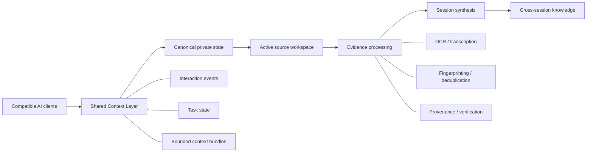
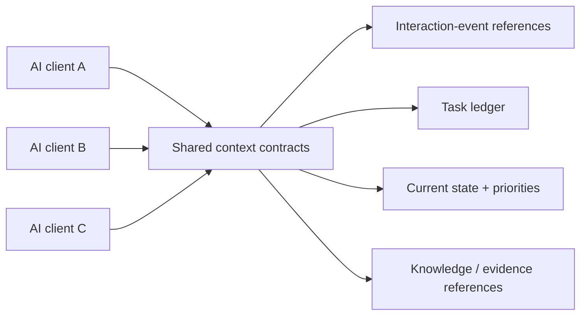
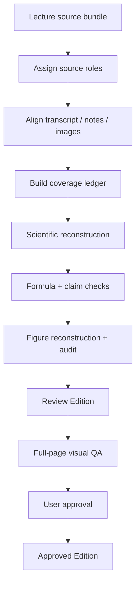
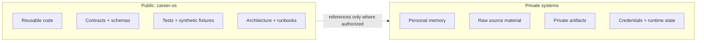
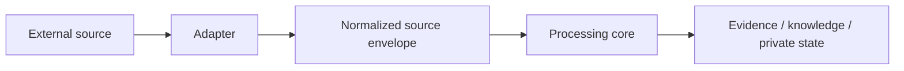

# Career OS

**A privacy-first framework for shared AI context and evidence-to-knowledge workflows.**


Career OS addresses two practical problems:

1. **AI continuity** — compatible AI clients should be able to continue the same project without replaying the full conversation history or creating competing state stores.
2. **Evidence-to-knowledge** — heterogeneous sources such as audio, images, transcripts, documents, and notes should become structured knowledge without losing provenance, uncertainty, conflicts, or source lineage.

The public repository contains reusable code, contracts, tests, synthetic examples, automation logic, and documentation. **Real user data, private source material, credentials, and runtime state are intentionally excluded.**

## System at a glance



Career OS separates **reasoning** from **continuity**. The active AI client performs reasoning; Career OS provides the contracts for state, routing, provenance, coordination, retrieval, and durable knowledge.

## Two core pillars

### 1. Shared AI context

Provider-neutral contracts make it possible to represent interaction history, active tasks, priorities, evidence references, and bounded handoff context without coupling the system to one model vendor.



Implementation evidence:
- `packages/core/src/shared-context.mjs`
- `tests/shared-context.test.mjs`
- `docs/SHARED_AGENT_CONTEXT.md`

### 2. Evidence -> knowledge

Career OS treats knowledge generation as a traceable pipeline rather than a one-shot summary.

```mermaid
flowchart LR
    A["Sources"] --> B["Identity + fingerprint"]
    B --> C["Privacy / authorization"]
    C --> D["Queue + retry-safe processing"]
    D --> E["Source-faithful evidence"]
    E --> F["Bounded retrieval bundle"]
    F --> G["SESSION_SYNTHESIS"]
    G --> H["Verification + uncertainty"]
    H --> I["Cross-session consolidation"]
    I --> J["COURSE_KNOWLEDGE"]
```



The pipeline preserves:
- source/version lineage;
- duplicate suppression;
- uncertainty and conflicts;
- model/provider metadata;
- verification state;
- separation between extracted evidence and inferred knowledge.

## Master Notes: concrete learning workflow

A reusable **Master Notes execution contract** defines how an AI should turn a complete lecture-source bundle into a source-faithful, scientifically checked course script.



Typical source roles:
- **Transcript** -> spoken sequence, explanations, motivation, examples, caveats;
- **Handwritten notes / board captures** -> formulas, notation, geometry, diagrams;
- **Lecture images** -> direct visual evidence;
- **Audio** -> ambiguity resolution when transcript evidence is insufficient;
- **Generated notes** -> secondary checklist only.

The canonical contract is in `docs/MASTER_NOTES_CANONICAL_SPECIFICATION_v1.md`.

**Important scope boundary:** the reusable execution contract and knowledge-compilation components are present in this repository, while fully autonomous production-grade Master Notes generation remains a partial capability rather than a completed production claim.

## Public / private boundary



Public code must not contain:
- personal contact details;
- private identifiers;
- private Drive IDs or URLs;
- credentials or tokens;
- raw CVs, transcripts, certificates, contracts, audio, images, or private generated notes;
- user-specific task/conversation content or runtime state.

See `PRIVACY.md` and `docs/GOVERNANCE.md`.

## What is verifiable in this repository

The table below intentionally lists only claims with inspectable public evidence.

| Capability | Evidence in the repository | Status |
|---|---|---|
| Provider-neutral shared-context contracts | `packages/core/src/shared-context.mjs`, tests | **PARTIAL** — contracts implemented; client-specific adapters remain |
| Multi-provider AI adapter/runtime patterns | `apps/apps-script-runtime/src/modules/93_provider_adapter.gs`, provider modules | **IMPLEMENTED IN PROJECT SCOPE** |
| Metadata + lexical evidence retrieval | `packages/knowledge/src/retrieval.mjs` | **WORKING** |
| Structured session synthesis with evidence references | `packages/knowledge/src/compiler.mjs` | **PARTIAL** — production automation disabled |
| Cross-session consolidation / lineage | `packages/knowledge/src/cross-session.mjs`, synthetic demo | **PARTIAL** — broader real-source validation remains |
| Master Notes execution contract | `docs/MASTER_NOTES_CANONICAL_SPECIFICATION_v1.md` | **WORKING SPECIFICATION** |
| Source fingerprinting, queue/retry processing, OCR/audio paths | Apps Script runtime modules + tests | **WORKING / provider-dependent** |
| Current-tree and Git-history privacy gates | `scripts/privacy-check.mjs`, `scripts/privacy-history-check.mjs`, CI | **WORKING** |

For the complete capability matrix, see `docs/IMPLEMENTATION_STATUS.md`.

## Public synthetic demo

The repository includes a data-free cross-session knowledge demo:

```bash
npm run demo:knowledge
```

It demonstrates:
- concept merging across sessions;
- deduplication;
- uncertainty preservation;
- evidence references;
- source-version lineage;
- explicit unverified-derived-knowledge status.

See `examples/synthetic-knowledge/`.

## Runtime model

The current concrete runtime uses **Google Apps Script near Google Drive** for low-overhead event-driven source processing.

The architecture itself remains provider-neutral:



A new source system or AI client should integrate through an adapter rather than redefine identity, provenance, or state semantics.

## Multi-provider integration

Project code includes adapter/runtime patterns for:
- Gemini vision/audio paths;
- Groq Whisper transcription;
- TU Braunschweig KI-Toolbox text-provider access;
- provider telemetry;
- privacy gating;
- retry / backoff / rate-limit handling.

This supports a **multi-provider integration** claim. It does **not** imply expert-level proficiency with every provider or a universal production adapter for every AI client.

## What this project does not claim

Career OS deliberately avoids turning design ideas into implementation claims.

Not claimed as production-complete:
- a production vector database;
- implemented embedding/vector search as the active retrieval engine;
- a production RAG platform;
- universal plug-and-play adapters for every AI client;
- fully autonomous production Master Notes generation;
- fully automatic production knowledge triggering.

Where these ideas appear in architecture documents, they are design directions unless separately marked as implemented.

## Repository map

```text
career-os/
├── apps/
│   ├── apps-script-runtime/       # Drive-adjacent runtime and provider paths
│   └── ingestion/                 # reusable ingestion vertical slice
├── packages/
│   ├── core/                      # identities, context, shared-agent contracts
│   ├── knowledge/                 # retrieval, synthesis, verification, consolidation
│   └── persistence/               # private-backend port / promotion support
├── examples/
│   └── synthetic-knowledge/       # public data-free knowledge demo
├── scripts/                       # validation, privacy, build checks
├── tests/                         # public synthetic/unit/integration tests
└── docs/                          # architecture, governance, specs, runbooks
```

## AI-agent entrypoint

A compatible agent should:

1. read this README;
2. load `docs/SESSION_BOOTSTRAP.md`;
3. apply `docs/ROUTING_PROTOCOL.md` and `docs/SESSION_HARVEST_PROTOCOL.md`;
4. request only the private context needed for the current task;
5. work against bounded references instead of replaying the full history;
6. persist meaningful deltas to the approved private backend.

## Development

Requirements:
- Node.js 20+

Run the public test suite:

```bash
npm test
```

Run privacy checks:

```bash
npm run check:privacy
node scripts/privacy-history-check.mjs
```

Build the Apps Script runtime:

```bash
npm run build:apps-script
```

No private credentials or personal data are required to run the public tests.

## Status

Career OS is at a **portfolio-ready v0.1 milestone** and is now maintained as a long-lived project rather than a closed one-off prototype.

The current focus is:
- keep the public/private boundary strict;
- keep claims tied to inspectable evidence;
- evolve shared-context interoperability as real client adapters become available;
- improve evidence-to-knowledge quality through reusable, source-audited workflows;
- avoid architecture expansion without a concrete use case.

## Design principles

1. **One canonical owner per durable fact.**
2. **Chats and agents are execution surfaces, not truth stores.**
3. **History remains recoverable; current state remains compact.**
4. **Evidence and inference stay distinct.**
5. **Unknown and conflicting information are preserved rather than silently repaired.**
6. **Provider/model choice is an adapter concern.**
7. **Idempotency and provenance are first-class.**
8. **Privacy boundaries are enforced before convenience.**
9. **Automation should remove repeated work, not create infrastructure for its own sake.**
10. **Public claims should be inspectable in code, tests, demos, or specifications.**
